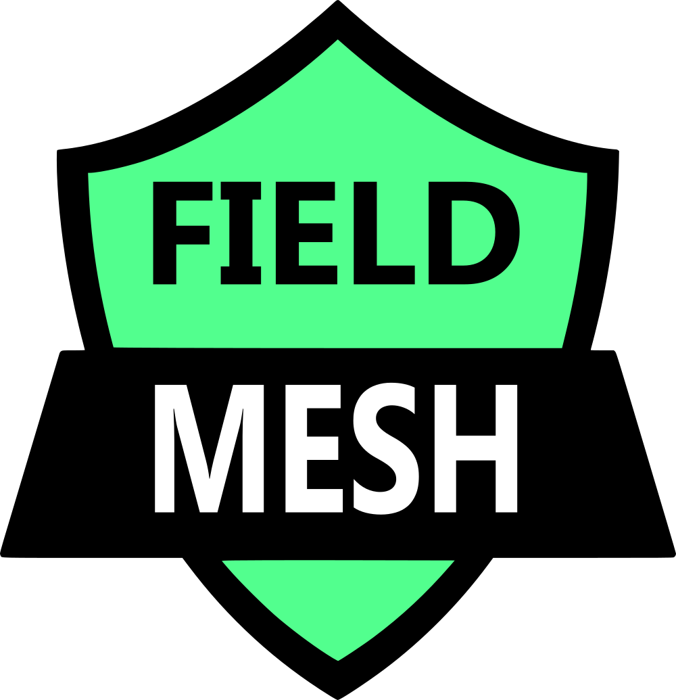
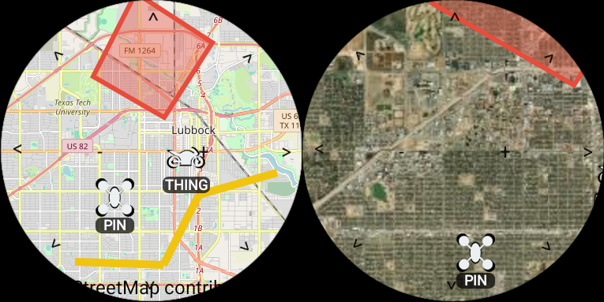

# FieldMesh

**Your Off-Grid Geo Awareness Tool, Powered by Meshtastic.**

FieldMesh is an application designed to enhance situational awareness and team coordination in environments where conventional communication infrastructure is unavailable or unreliable. By leveraging the power of Meshtastic devices, FieldMesh provides a robust platform for off-grid mapping, location tracking, and messaging.

It's an ideal companion for outdoor enthusiasts, airsoft players, search and rescue teams, and anyone needing reliable communication and shared awareness in disconnected scenarios.

## Key Features

* **P2P Architecture:** no centralized node required all nodes can sync with each other.

* **Low bandwidth:** all messages are designed to be as small as they can so not to overwhelm the mesh.  

* **Real-Time Team Tracking:** Based on the already developed Meshtastic Position App.

* **Point of Interest (POI) Marking:** Easily mark and share important locations, such as objectives, rally points, hazards, or resources.

* **Intuitive Mapping Interface:** User-friendly map display for clear visualization of your surroundings and team positions.

* **Offline Map Support:** Auto cache maps by panning around the map or use your own Mbtile files.

* **Search:** Search Lat and Lon.

* **Android Wear Support:** from old to new devices you can have the map data displayed on your watch.

## Screenshots

## Why FieldMesh?

Meshtastic has a low bandwidth limitation and a Peer to Peer nature this app is designed to work under those constraints. 

## Use Cases

* **Hiking & Backpacking:** Share locations with your group, mark trails, and ensure everyone stays connected in remote wilderness.

* **Outdoor Adventures:** Enhance safety and coordination for activities like hunting, fishing, and off-roading.

* **Emergency Preparedness:** A valuable tool for community groups and families to stay connected during disasters when other communications are down.
  
* **Event Management:** Coordinate staff and volunteers over large outdoor areas.

* **Airsoft & MilSim:** Coordinate squad movements, mark objectives, and maintain communication in the field.

## Support the project

If you like what  I am doing become a member:

## Getting Started

1. **Prerequisites:**

   * Meshtastic-compatible hardware.

   * The [Meshtastic](https://github.com/meshtastic) application  installed on your device.

2. **Setup:**

   * Just Install and use!

   * Form Mbtiles just add them to \Android\data\io.github.field-mesh\files\offline_maps

3. **Usage:**

   * Explore the map and add and remove Markers.

## Contributing

Contributions are welcome! Still working on the details of this but fell free to add.

## Disclaimer

I am a one man army here the app in its current will have bugs, if you find one create an issue with the details, this will really help the project. 

This was only tested using a max of 2 nodes if you have more please test and report results.

## License

This project is licensed under the GPL 3.0 License - see the `LICENSE` file for details.

